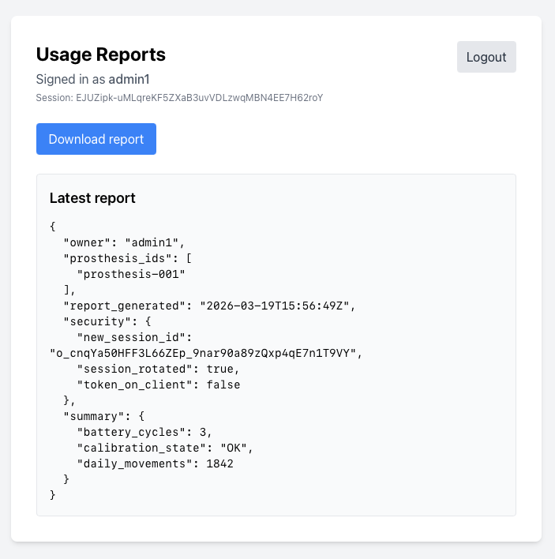

# BionicPRO — задача 3

## Что сделано
- добавлен новый сервис `bionicpro-auth`;
- frontend больше не использует `keycloak-js` и не получает токены;
- вход идёт через `bionicpro-auth -> Keycloak` по Authorization Code Flow with PKCE;
- `access_token` хранится в оперативной памяти сервиса;
- `refresh_token` хранится в зашифрованном виде в памяти сервиса (AES-GCM);
- токены привязаны к `session_id`;
- frontend получает только `HttpOnly` cookie;
- `access_token` обновляется автоматически через `refresh_token`;
- на каждом успешном обращении к защищённому ресурсу выполняется ротация `session_id`;
- в Keycloak включён refresh flow и `accessTokenLifespan = 120` секунд.

## Запуск
```bash
docker compose down -v
rm -rf postgres-keycloak-data
docker compose up --build
```

## Тестовый пользователь
- `prothetic1 / prothetic123`

